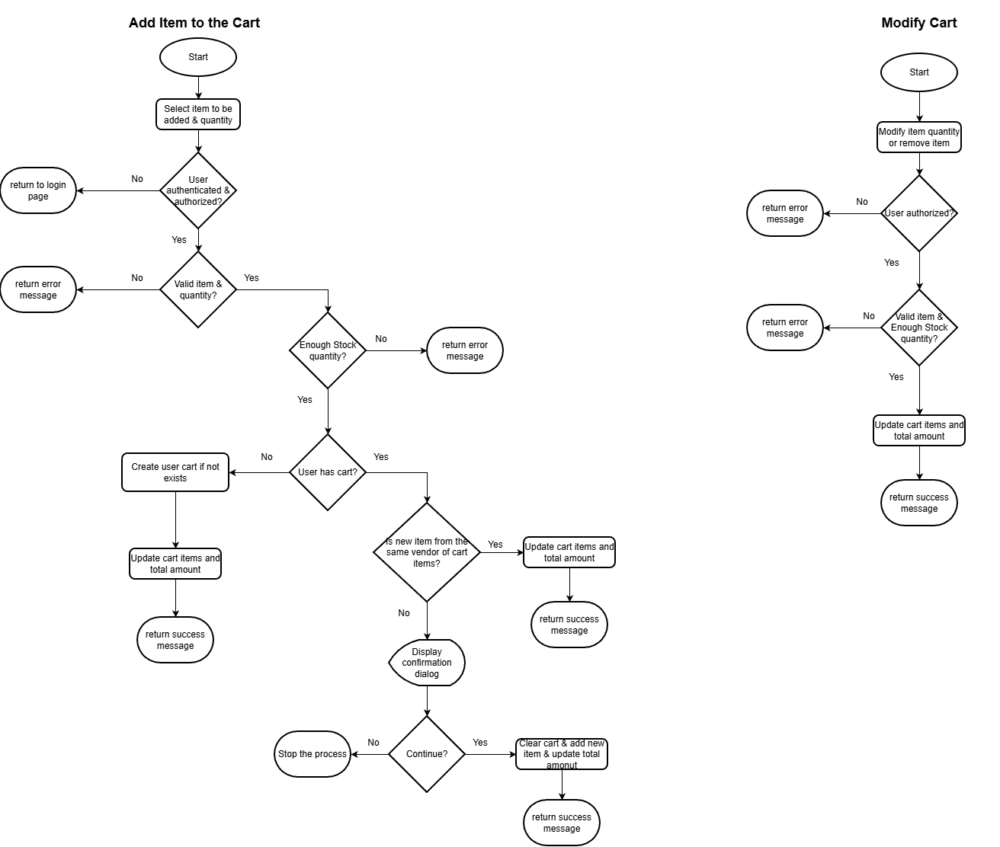
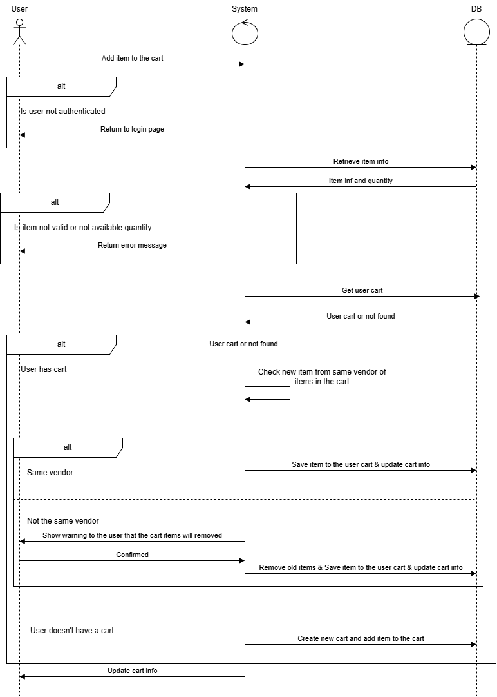
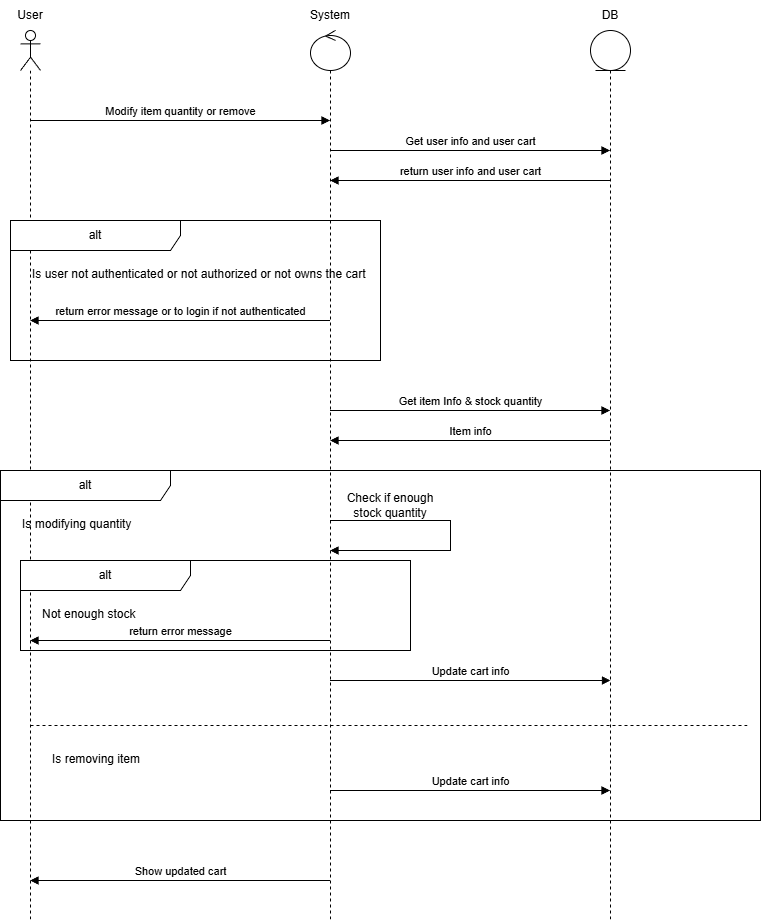
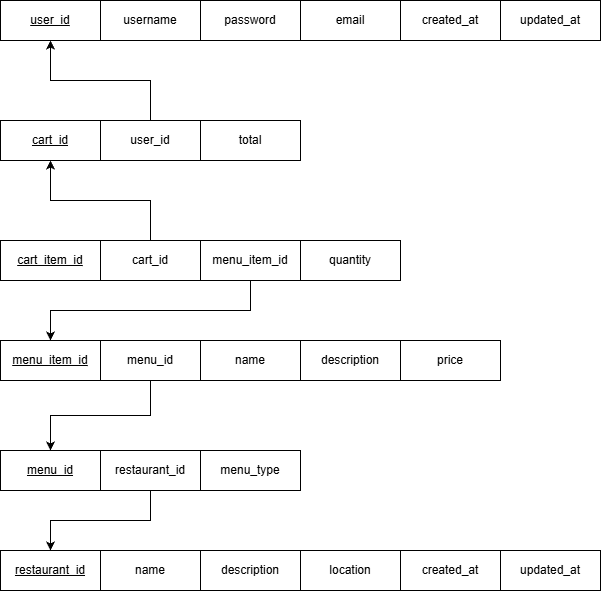

# Food-Delivery-System


This repository contains a system analysis document for a Food Delivery System. The document outlines the system's requirements, functionalities, and design considerations to facilitate the development of a robust and efficient food delivery application.


## Features

- User Authentication & Authorization.
- Restaurants Management.
- Menu Management.
- Cart Management.
- Order Placement & Tracking.
- Payment Integration.
- Delivery Integration.

---

## User Authentication & Authorization Functionalities

- Register new users.
- Login and logout functionality.
- Password recovery and reset.

---

## Restaurants Management Functionalities

- Add, update, and delete restaurant profiles.
- View restaurants list and details.
- Search and filter restaurants by cuisine, location, ratings, etc.

---

## Menu Management Functionalities

- Add, update, and delete menu items.
- View menu for a specific restaurant.
- View detailed information about menu items including price, availability, description, etc.
- Search and filter menu items by category, price, popularity, etc.

---

## Cart Management Functionalities

- Add, update quantities, and remove items.
- View cart summary with item details and total price.

---

## Order Placement & Tracking Functionalities

- Place orders from the cart.
- View order history and details.
- Checkout placed order.
- Selecting payment method.
- Providing delivery or pickup details.
- Track order status in real-time (e.g., preparing, out for delivery, delivered).
- Receive notifications about order status updates.
- Cancel orders before they are processed.

---

## Payment Integration Functionalities

- Integrate with payment gateways for processing payments.
- Support multiple payment methods (credit/debit cards, digital wallets, etc.).

---

## Delivery Integration Functionalities

- Integrate with delivery services for order fulfillment.
- Support multiple delivery options (delivery, pickup, etc.).

---

## Cart Management Analysis

### Flowchart Diagram



### Sequence Diagram

#### Add Item to Cart



#### Modify Cart Items



### Entity-Relationship Diagram



### Pseudocode

#### Add Item to Cart

```text
FUNCTION addItemToCart(userId, itemId, quantity):
    IF userId IS NOT AUTHENTICATED:
        RETURN "User not authenticated"
    
    cart = getUserCart(userId)
    
    IF cart DOES NOT EXIST:
        cart = createNewCart(userId)
    
    item = getItemById(itemId)
    
    IF item DOES NOT EXIST:
        RETURN "Item not found"
    
    IF item.availability < quantity:
        RETURN "Insufficient item availability"
    
    IF cartContainsOtherRestaurantItems(cart, item.restaurantId):
        showConfirmation("Your cart contains items from another restaurant. Do you want to clear the cart and add this item?")
        IF user CONFIRMS:
            clearCart(cart)
            addItemToCart(cart, item, quantity)
            updateCartInfo(cart)
        ELSE:
            RETURN "Item not added to cart"
    ELSE
        addItemToCart(cart, item, quantity)
        updateCartInfo(cart)
     
    RETURN "Item added to cart successfully"
```

#### Modify Cart Items

```text
FUNCTION modifyCartItem(userId, cartId, itemId, quantity):
    cart = getCartById(cartId)
    
    IF cart DOES NOT EXIST:
        RETURN "Cart not found"
    
    item = getItemById(itemId)
    
    IF item DOES NOT EXIST:
        RETURN "Item not found"
    
    IF modifyingItemQuantity():
        IF item.availability < quantity:
            RETURN "Insufficient item availability"
        ELSE:
            updateItemQuantityInCart(cart, item, quantity)
            updateCartInfo(cart)
            RETURN "Item quantity updated successfully"
    ELSE IF removingItemFromCart():
        removeItemFromCart(cart, item)
        updateCartInfo(cart)
        RETURN "Item removed from cart successfully" 
```        